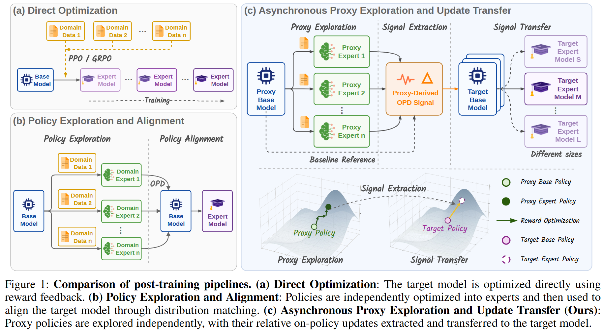
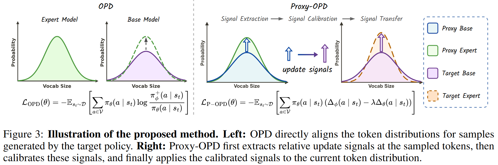
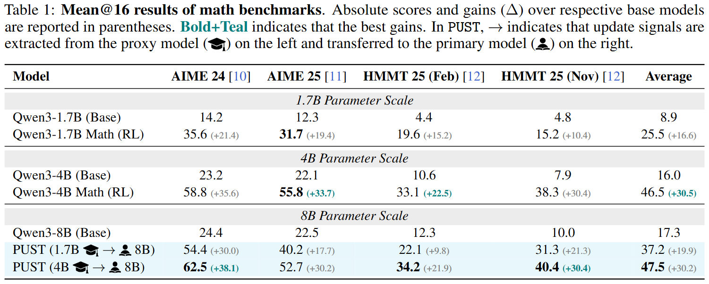
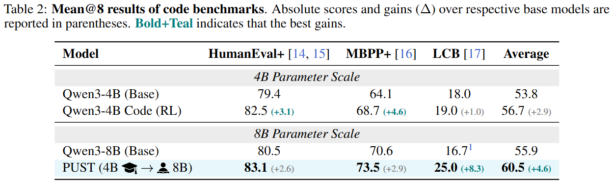
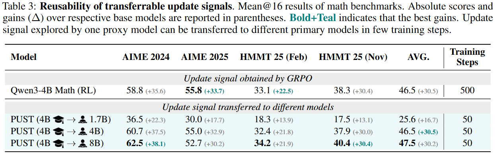
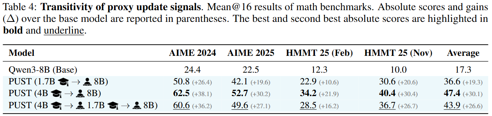
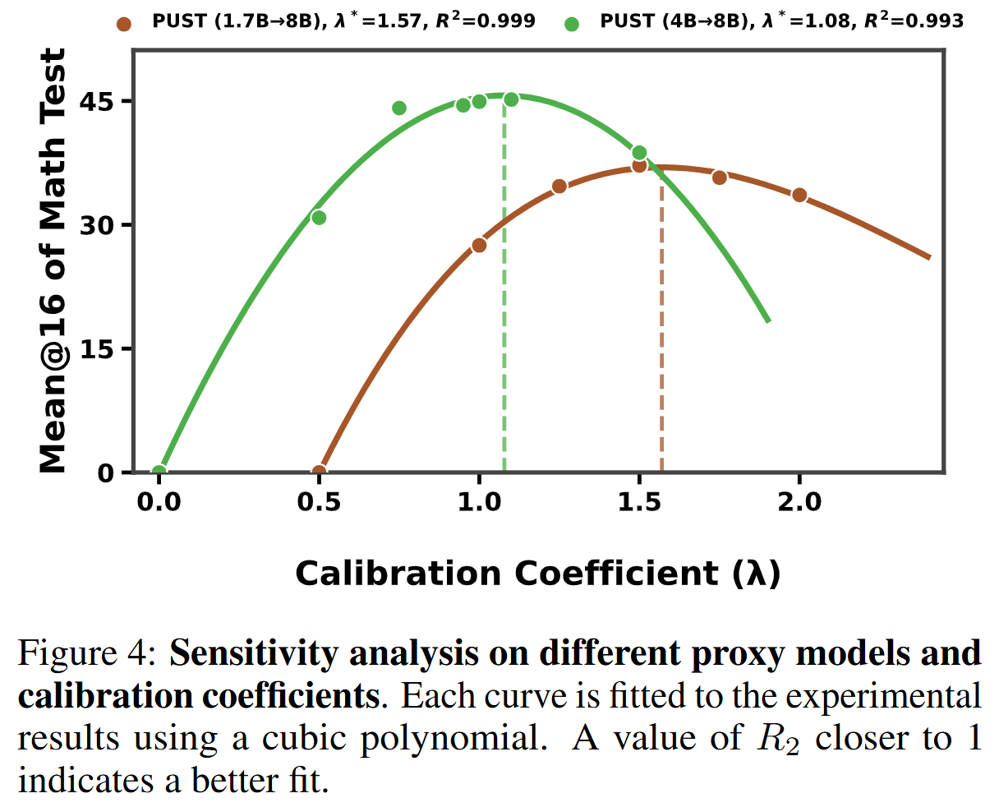

<div align="center">

<h1>POPD</h1>
<h3>Proxy OPD: On-Policy Distillation with Transferable Relative Proxy Update</h3>
<p>Decoupling exploration from alignment for asynchronous, reusable, and cross-model post-training.</p>

<p>
  <a href="https://arxiv.org/abs/2607.11505"></a>
  &nbsp;
  <a href="https://huggingface.co/KnowledgeXLab/PUST-Experiments"></a>
  &nbsp;
  <a href="assets/POPD.pdf"></a>
</p>

</div>

> 💡 POPD decouples LLM post-training into **proxy exploration** → **update-signal extraction** → **signal transfer**. A lightweight proxy performs low-cost trial-and-error, while the primary model aligns to relative improvement signals via on-policy distillation.


<p align="center">
  
</p>

## ⚙️ Method

<p align="center">
  
</p>

POPD extracts the relative improvement between the initial and optimized proxy policies:

$$\Delta_\phi(a \mid s_t) = \log \frac{\pi_\phi^+(a \mid s_t)}{\pi_\phi(a \mid s_t)}$$

The primary model's absorbed update is measured relative to its frozen anchor:

$$\Delta_\theta(a \mid s_t) = \log \frac{\pi_\theta(a \mid s_t)}{\pi_{\mathrm{ref}}(a \mid s_t)}$$

The calibration coefficient $\lambda$ prevents the primary model from repeatedly over-applying a static proxy signal:

$$r_\lambda(a \mid s_t) = \Delta_\phi(a \mid s_t) - \lambda  \Delta_\theta(a \mid s_t)$$

The primary model is optimized with:

$$\mathcal{L}_{\mathrm{POPD}}(\theta) = -\mathbb{E}_{s_t \sim \mathcal{D}} \left[ \sum_{a \in \mathcal{V}} \pi_\theta(a \mid s_t) \left( \log \frac{\pi_\phi^+(a \mid s_t)}{\pi_\phi(a \mid s_t)} - \lambda \log \frac{\pi_\theta(a \mid s_t)}{\pi_{\mathrm{ref}}(a \mid s_t)} \right) \right]$$

Here $\pi_\phi$, $\pi_\phi^+$, and $\pi_{\mathrm{ref}}$ are frozen; only $\pi_\theta$ is updated. A larger $\lambda$ yields more conservative transfer.

## 📊 Results

Evaluated with Qwen3 models on DeepMath-103K (math) and Eurus-RL-Code (code):

- **Weak-to-strong transfer:** 1.7B / 4B proxy signals improve an 8B primary model.
- **Reusable signals:** the same signal transfers to primary models at different scales in 50 steps.
- **Multi-hop transfer:** signals remain useful across sequences such as 4B → 1.7B → 8B.

<p align="center">
  
</p>

<p align="center">
  
</p>

<p align="center">
  
</p>

<p align="center">
  
</p>

<p align="center">
  
</p>

Performance peaks at $\lambda^* \approx 1.51$ for the 1.7B proxy and $\lambda^* \approx 1.08$ for the 4B proxy. Both optima exceed 1.0, indicating that proxy signals should be down-scaled to avoid over-updating; the stronger 4B proxy also achieves a higher peak.


## 📦 Model Weights

Pre-trained GRPO checkpoints are available on <a href="https://huggingface.co/KnowledgeXLab/PUST-Experiments"> <b>Hugging Face</b></a>.

| Checkpoint | Role | Training |
|:--|:--|:--|
| [`Qwen3-1.7B-Math-GRPO-Steps500`](https://huggingface.co/KnowledgeXLab/PUST-Experiments/tree/main/Qwen3-1.7B-Math-GRPO-Steps500) | Proxy | DeepMath-103K · GRPO · 500 steps |
| [`Qwen3-1.7B-Math-GRPO-Steps800`](https://huggingface.co/KnowledgeXLab/PUST-Experiments/tree/main/Qwen3-1.7B-Math-GRPO-Steps800) | Proxy | DeepMath-103K · GRPO · 500 steps |
| [`Qwen3-8B-Math-GRPO-Steps400`](https://huggingface.co/KnowledgeXLab/PUST-Experiments/tree/main/Qwen3-8B-Math-GRPO-Steps400) | Primary | DeepMath-103K · GRPO · 400 steps |


## 🛠️ Installation

**Requirements:** Python ≥ 3.10, CUDA ≥ 12.4, 8× GPU recommended for the default scripts (Qwen3-8B with TP=8).

```bash
git clone https://github.com/KnowledgeXLab/POPD.git
cd POPD

# Core dependencies (verl + POPD training stack)
pip install -r verl/requirements.txt
pip install vllm pebble

# Or follow verl's full install script (includes pinned torch/vllm versions):
# bash verl/scripts/install_vllm_sglang_mcore.sh
```

Place base models and proxy checkpoints under `./models/` (see [Model Weights](#-model-weights)). Example layout:

```
models/
├── Qwen3-8B/                          # primary model
├── Qwen3-4B/                           # proxy base
├── Qwen3-4B-Non-Thinking-RL-Math-Step1200/   # math proxy expert (π_φ⁺)
└── Qwen3-4B-Non-Thinking-RL-Code-Step300/    # code proxy expert
```

Download from [Hugging Face PUST-Experiments](https://huggingface.co/KnowledgeXLab/PUST-Experiments) or use your own GRPO-trained proxy checkpoints.

## 📂 Data Preparation

Training data must be in **verl parquet format** (see [verl data docs](verl/docs/preparation/prepare_data.rst)). Each row needs:

| Field | Description |
|:--|:--|
| `data_source` | Dataset name; routes to the correct reward function |
| `prompt` | Chat messages, e.g. `[{"role": "user", "content": "..."}]` |
| `ability` | Task type (`Math` or `Code`) |
| `reward_model.ground_truth` | Reference answer or test cases |
| `extra_info` | Optional metadata (e.g. benchmark source tag) |

### Math (DeepMath-103K)

Convert [DeepMath-103K](https://huggingface.co/datasets/zwhe99/DeepMath-103K) to parquet and place at:

```
data/math/train.parquet    # training set
data/math/test.parquet     # validation (multi-benchmark mix)
```

Validation benchmarks referenced in the training script: `AIME2024`, `AIME2025`, `AIME2026`, `SMT2025`, `CMIMC2025`, `HMMT2025FEB`, `HMMT2025NOV`, `HMMT2026FEB`. Set `data_source` in each row so the math-verify reward router can identify them.

### Code (Eurus-RL-Code)

Convert [PRIME-RL/Eurus-2-RL-Data](https://huggingface.co/datasets/PRIME-RL/Eurus-2-RL-Data) (code split) to parquet:

```
data/Eurus/code_train.parquet
data/Eurus/code_validation.parquet
```

Supported code sources: `taco`, `apps`, `codecontests`, `codeforces`.

### Offline math benchmarks (evaluation only)

For standalone math eval, place benchmark jsonl files under `data/`:

```
data/aime24/test.jsonl
data/aime25/test.jsonl
data/hmmt25_feb/test.jsonl
data/hmmt25_nov/test.jsonl
```

Each line: `{"problem": "...", "answer": "..."}`.


## 🏋️ Training

Run from the **repository root**. Scripts auto-detect paths relative to the repo.

### Math

Starts a local math-verify HTTP server, then launches POPD training on 8 GPUs:

```bash
bash scripts/popd_qwen3-8b_math.sh
```

Resume from a checkpoint:

```bash
bash scripts/popd_qwen3-8b_math.sh --resume_path ./models/saved_models/POPD_Math@16/<experiment_name>
```

Key knobs (edit at the top of the script):

| Variable | Default | Meaning |
|:--|:--|:--|
| `lambda_vals` | `1.0` | Calibration coefficient λ |
| `student_model_name` | `Qwen3-8B` | Primary model |
| `teacher_model_name` | `Qwen3-4B-Non-Thinking-RL-Math-Step1200` | Proxy expert π_φ⁺ |
| `teacher_base_model_name` | `Qwen3-4B` | Proxy base π_φ |
| `n_gpu` | `8` | GPUs per node |
| `val_n` | `16` | Samples per validation prompt |

Checkpoints are saved to `./models/saved_models/POPD_Math@<val_n>/<experiment_name>/`.

### Code

```bash
bash scripts/popd_qwen3-8b_code.sh
```

Code training uses in-process parallel code execution (no HTTP verify server). Key knobs mirror the math script; reward is computed via `verl/verl/utils/reward_score/code_eval_reward/`.

Checkpoints: `./models/saved_models/POPD_Code@<val_n>/<experiment_name>/`.

Extra Hydra overrides can be appended, e.g.:

```bash
bash scripts/popd_qwen3-8b_math.sh actor_rollout_ref.actor.policy_loss.lambda_vals=1.5 trainer.total_epochs=1
```


## 📏 Evaluation

### Math — offline benchmarks

```bash
cd math_eval

# Edit MODEL_PATH in run_eval_math.sh, then:
bash run_eval_math.sh
```

Or run a single benchmark:

```bash
cd math_eval
python eval_math.py \
    --input_file ../data/aime24/test.jsonl \
    --model_path ./models/Qwen3-8B \
    --output_file ./eval_outputs/aime24/Qwen3-8B.jsonl \
    --max_tokens 16384 --temperature 1.0 --top_p 1.0 --n 32
```

Uses [math-verify](https://github.com/huggingface/Math-Verify) for answer checking. Results are written to `./eval_outputs/`.

### Code — HumanEval+ / MBPP+

From the repository root:

```bash
bash code_eval/scripts/run_evalplus.sh humaneval Qwen/Qwen3-8B 1
# args: <dataset: humaneval|mbpp> <model_path> <greedy: 1|0> [temperature] [top_p] [n_samples]
```

### Code — LiveCodeBench

```bash
bash code_eval/scripts/run_lcb_gen.sh \
    --model Qwen/Qwen3-8B \
    --local_model_path ./models/Qwen3-8B \
    --gpu 0 --n 4
```


## 🙏 Acknowledgement

Our training and evaluation code builds upon the following open-source projects:

- <a href="https://github.com/RUCBM/G-OPD"><b><u>G-OPD</u></b></a> — Generalized On-Policy Distillation framework for post-training and evaluation
- <a href="https://github.com/volcengine/verl"><b><u>verl</u></b></a> — Volcano Engine Reinforcement Learning framework for LLMs (the base of G-OPD)
